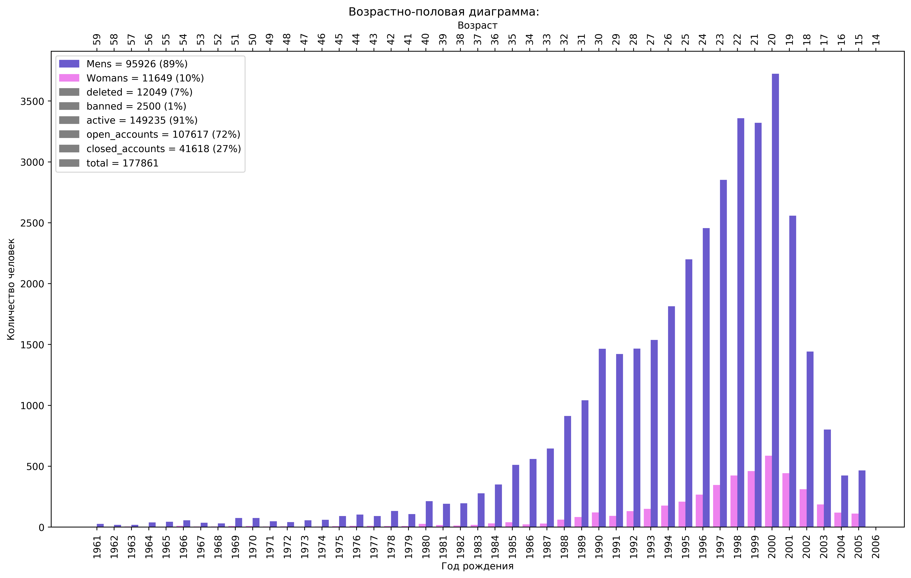

### vk.com community members sex and age distribution (population pyramid)

**Скрипт для получения графика и данных распределения участников сообщества вк по полу и возрасту (Возрастно-половая пирамида)**

Пример:

#### Запуск
+ Установить пакеты из `requirements.txt`
+ Заменить шаблоны в `secret.json` на свои логин и пароль
+ Ввести короткую ссылку на сообщество или пользователя в переменную TARGET
+ Запустить
+ Данные и график сохранятся в этом же каталоге в одноименной с TARGET папке

Примечание: Да, ввод логина и пароля не самый лучший метод, однако самый простой. Вы можете сами проанализировать мой код и код vk-api чтобы убедиться в их безопастности. Если же вы хотите реализовать метод авторизации Implicit Flow, то я готов к сотрудничеству.

#### Функции

Класс разбит на 4 главных функции:

+ *get_members_ids* - получает id всех участников сообщества или друзей пользователя

+ *get_users_data* - получает данные о возрасте и поле этих id

Поскольку в ВК стоит ограничение на количество вызовов методов api в сутки. То сообщества с огромным количеством пользователей получится проанализировать не чаще пары раз в сутки. Поэтому для экономии запросов, данные об id участников и дополнительные поля сохраняются в виде json в ту же папку. После сохранения данных рекомендую выключить вызов *get_members_ids* и *get_users_data*

+ *calculate* - подсчитывает различиные параметры о пользователях, меняйте на свой усмотрение
+ *make_plot* - строит гистограмму распределения по полу и возрасту

В качестве TARGET подойдёт короткая ссылка на сообщество или id пользователя. Не забудьте поменять type group_members / user_friends